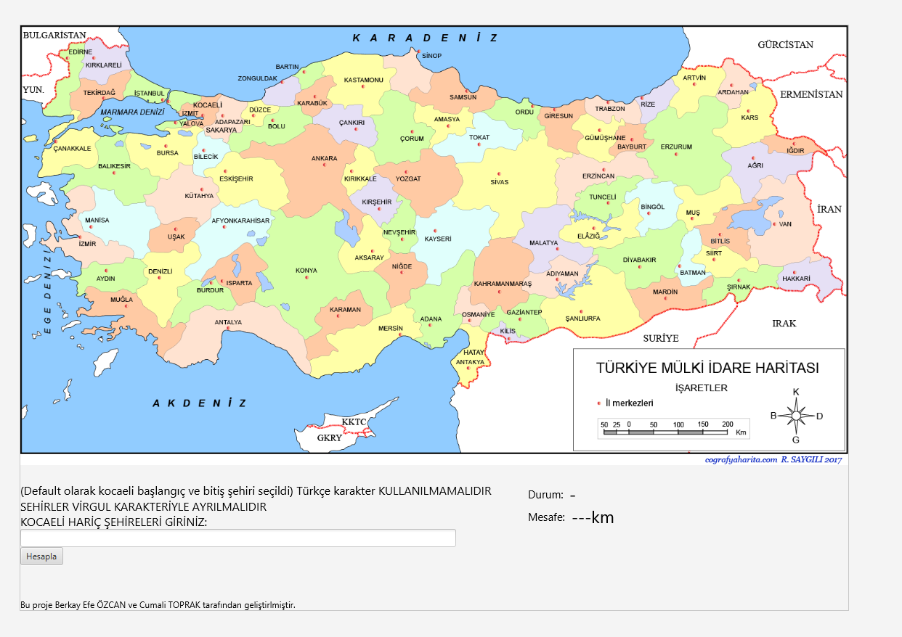
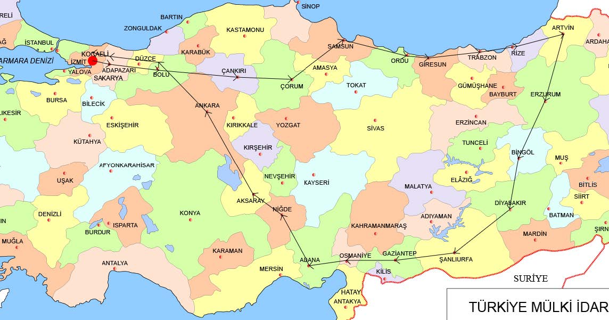

# Shortes-Route-Problem-with-Graph-
This repository include 2rd project of 'Programming Lab-2' at Computer Engineering Kocaeli University

Calculated Shortest Route

## Özetçe 
Bu projede gezgin kargo probleminin çözümlenmesi amaçlanmaktadır. Amaç kullanıcının tasarladığımız kullanıcı arayüzü ile girdiği şehirleri dolaşması ve başladığı noktaya mümkün olan en kısa yollardan geri dönmesidir. Biz de bu noktada mümkün olan en verimli algoritmalar üzerinde çalışmalar yaparak bu probleme çözüm bulduk. Kullandığımız algoritmalar ve detayları ilerleyen bölümlerde detaylıca ele alınacaktır. Tasarladığımız yazılım oldukça kullanıcı dostu bir arayüze sahip olup oldukça kolay anlaşılabilir. Ayrıca bu proje Java programlama dili kullanılmıştır.

## Abstract
In this project, it is aimed to solve the traveler cargo problem. The aim is to navigate the cities that the user enters with the user interface we designed and return to the starting point in the shortest possible way. At this point, we found solutions to this problem by working on the most efficient algorithms possible. The algorithms we use and their details will be discussed in detail in the following sections. The software we designed has a very user-friendly interface and is easy to understand.

## Developers / Geliştiriciler
Berkay Efe ÖZCAN , Cumali TOPRAK
